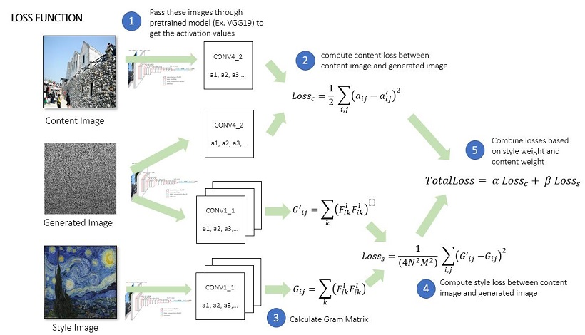

# Neural Style Transfer in Tensorflow - Short Note

This personal note is perhaps for a person who is already familiar with the concept of neural style transfer.
For people who are new in this area, it is recommended to read reference's section belows:

## What is Neural Style Transfer
- Neural Style Transfer is the technique that creates a new image with a certain style from an artistic image
- It can be understood easily through the examples below:

  
## High-Level Intuition
- when the input image passes through feed-forward convolutional neural network, each layer acts as a collection of filters, which extract certain features from the image
- It is found that, with pre-trained weights, style and content can be obtained and, therefore, it is possible to merge both of them into a new image 

## How to implement

### Pre-Processing
- Firstly, we need to build the VGG model and load pre-defined weights
- In this part, with some modification, I use the code from *Chip Huyen, CS20: "TensorFlow for Deep Learning Research", Stanford*

### Model Implementation
- Unlike traditional nerual network, we train the model to update the generated image
- In other words, the weights and biases of the model are fixed, but the input image (generated image) is trainable

#### Loss function
- In neural style transfer, loss function can be broken into Content Loss and Style Loss

##### Content Loss
- To calculate content loss, we use the square error of two sets of value
  - activated function's values of content image in a certain content layer
  - activated function's values of generated image in a certain content layer
  

- Particularly, this solution uses *CONV4_2* as a representation layer of content

##### Style Loss
- Calculating style loss is a bit trickier
- It is needed to calculate the Gram Matrix to find the correlations among filters on a certain layer

- After getting a Gram Matrix, we calculate the square error to obtain style loss

## Dependencies
- Tensorflow
- cv2
- Numpy
- urllib

## References
- [Neural Algorithm of Artistic Style - Leon A. Gatys, Alexander S. Ecker, Matthias Bethge](https://arxiv.org/abs/1508.06576)
- [CS20: "TensorFlow for Deep Learning Research", Stanford](http://web.stanford.edu/class/cs20si/)
- [DeepLearning.ai](https://www.deeplearning.ai/)
- [Neural Artistic Style Transfer: A Comprehensive Look, Shubhang Desai](https://medium.com/artists-and-machine-intelligence/neural-artistic-style-transfer-a-comprehensive-look-f54d8649c199)
