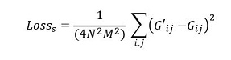

# Neural Style Transfer in Tensorflow

This repository has an objective to implement Neural Style Transfer according to [A Neural Algorithm of Artistic Style](https://arxiv.org/abs/1508.06576). Tensorflow and Python3 are used for development, and pre-trained VGG19 is adapted from [CS20: "TensorFlow for Deep Learning Research", Stanford](http://web.stanford.edu/class/cs20si/)

To understand this following note, I would recommend to know the concept of convolutional neural network

## What is Neural Style Transfer
Neural Style Transfer is the technique that creates a new image with the style derived from an artistic image. It can be understood easily through the examples below:

  
## High-Level Intuition
In general, when the input image is passed through feed-forward convolutional neural network, hidden layers act as a collection of filters, which extract certain features from the image. With regard to [A Neural Algorithm of Artistic Style](https://arxiv.org/abs/1508.06576), through internal representations, it is possible to manipulate content and style of that image and, therefore, style can be transferred to other images 

## Implementation

### Pre-Processing
- Firstly, we need to build the VGG model and load pre-defined weights
- In this part, with some modification, I use the code from *Chip Huyen, CS20: "TensorFlow for Deep Learning Research", Stanford*

### Model Implementation
- Unlike traditional nerual network, the image variables are used as a trainable parameters while weights and biases of the model are fixed

#### Loss function
- In neural style transfer, loss function is compose of Content Loss and Style Loss

##### Content Loss
- To calculate content loss, we use the square error of hidden representations between input image and generated image
  

- Particularly, this solution uses *CONV4_2* as a representation layer of content

##### Style Loss
- Calculating style loss is a bit trickier. It is needed to calculate the Gram Matrix to find the correlations among filters first

- And after getting a Gram Matrix, we calculate the square error to obtain style loss

## Execution
- Run *style_transfer.py* and generated image will be available in *outputs* folder 

## Dependencies
- Tensorflow
- cv2
- Numpy
- urllib

## References
- [Neural Algorithm of Artistic Style - Leon A. Gatys, Alexander S. Ecker, Matthias Bethge](https://arxiv.org/abs/1508.06576)
- [CS20: "TensorFlow for Deep Learning Research", Stanford](http://web.stanford.edu/class/cs20si/)
- [DeepLearning.ai](https://www.deeplearning.ai/)
- [Neural Artistic Style Transfer: A Comprehensive Look, Shubhang Desai](https://medium.com/artists-and-machine-intelligence/neural-artistic-style-transfer-a-comprehensive-look-f54d8649c199)
